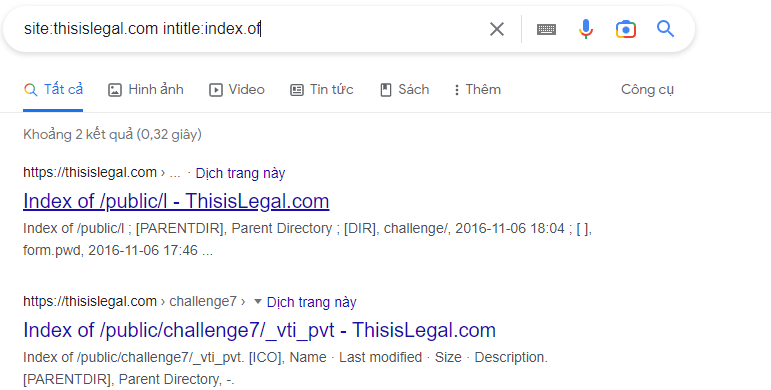
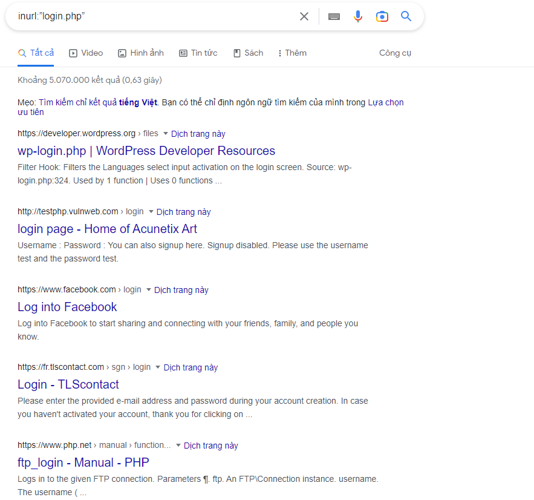
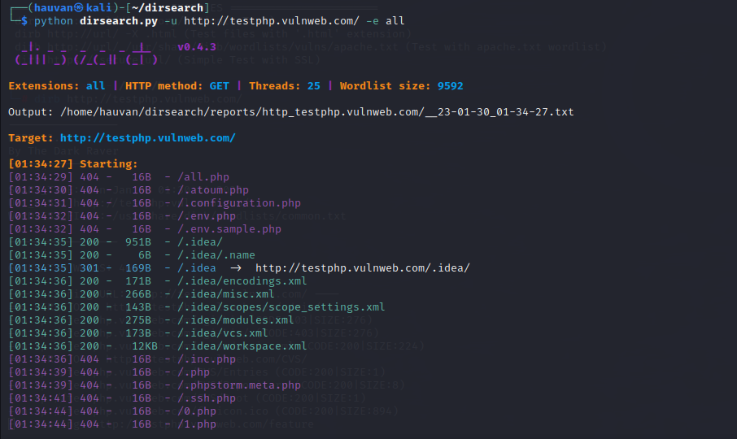

# Information gathering

## 1.[Conduction search engine discovery reconnaissance for information leakage.](https://owasp.org/www-project-web-security-testing-guide/v42/4-Web_Application_Security_Testing/01-Information_Gathering/01-Conduct_Search_Engine_Discovery_Reconnaissance_for_Information_Leakage) 

## 2.[Fingerprint web server.](https://owasp.org/www-project-web-security-testing-guide/v42/4-Web_Application_Security_Testing/01-Information_Gathering/02-Fingerprint_Web_Server)

## 3.[Review Webserver metafile for information leakage.](https://owasp.org/www-project-web-security-testing-guide/v42/4-Web_Application_Security_Testing/01-Information_Gathering/03-Review_Webserver_Metafiles_for_Information_Leakage)

## 4.[Enumerate Applications on Webserver.](https://owasp.org/www-project-web-security-testing-guide/v42/4-Web_Application_Security_Testing/01-Information_Gathering/04-Enumerate_Applications_on_Webserver)

## 5.[Review webpage Content for information leakage.](https://owasp.org/www-project-web-security-testing-guide/v42/4-Web_Application_Security_Testing/01-Information_Gathering/05-Review_Webpage_Content_for_Information_Leakage)

## 6.[Identify Applications Entry points.](https://owasp.org/www-project-web-security-testing-guide/v42/4-Web_Application_Security_Testing/01-Information_Gathering/06-Identify_Application_Entry_Points)

## 7.[Map Execution paths through Applications.](https://owasp.org/www-project-web-security-testing-guide/v42/4-Web_Application_Security_Testing/01-Information_Gathering/07-Map_Execution_Paths_Through_Application)

## 8.[Fingerprint Web Application Framework.](https://owasp.org/www-project-web-security-testing-guide/v42/4-Web_Application_Security_Testing/01-Information_Gathering/08-Fingerprint_Web_Application_Framework)

## 9.[Fingerprint Web Application.](https://owasp.org/www-project-web-security-testing-guide/v42/4-Web_Application_Security_Testing/01-Information_Gathering/09-Fingerprint_Web_Application)

## 10.[Map Application Archtecture.](https://owasp.org/www-project-web-security-testing-guide/v42/4-Web_Application_Security_Testing/01-Information_Gathering/10-Map_Application_Architecture)

# List need to check

### Dork in https://dorks.faisalahmed.me/#

### Use [google hacking database](https://www.exploit-db.com/google-hacking-database)

### Website
intitle: This dork will tell Google to show only those pages that have the term in their HTML title
```
site:thisislegal.com intitle:index.of
```

```
inurl:login.php
```

### Files
filetype: Searches for specific file types.
```txt
filetype:txt
```
intitle: You can look into file directories of websites directly and download specified file
```
intitle: “index of ” intext: “movie name” .
```
### Finding username and passwords
```
intext: passwords filetype: txt  
mysql history files 
intext: account details filetype: txt  
intitle:index.of intext:”secring .skr”|&q… 
people.lst  
passwd  
master.passwd  
pwd.db  
htpasswd / htpasswd.bak  
htpasswd / htgroup  
spwd.db / passwd  
passwd / etc (reliable)  
config.php  
```

## [Whatweb](https://github.com/urbanadventurer/WhatWeb)
usage(kali)
```
Whatweb 'url'
Help : whatweb -h
	
```
Example

`Whatweb thisislegal.com`

```
http://thisislegal.com [302 Found] Apache[2.4.48], Country[UNITED KINGDOM][GB], HTTPServer[Unix][Apache/2.4.48 (Unix) OpenSSL/1.1.1k PHP/8.0.7], IP[178.79.182.67], OpenSSL[1.1.1k], PHP[8.0.7], RedirectLocation[https://thisislegal.com/], Title[302 Found]
https://thisislegal.com/ [200 OK] Apache[2.4.48], Cookies[PHPSESSID], Country[UNITED KINGDOM][GB], Frame, HTML5, HTTPServer[Unix][Apache/2.4.48 (Unix) OpenSSL/1.1.1k PHP/8.0.7], IP[178.79.182.67], JQuery, Meta-Author[t0mmy9 and sOwL], OpenSSL[1.1.1k], PHP[8.0.7], PasswordField[password], Script[text/javascript], Title[ThisisLegal.com - Are You?], X-Powered-By[PHP/8.0.7], X-UA-Compatible[IE=edge]
```

## Review robots.txt,HTML tags (<META>)...

## Sub domain 
Subdomain enumeration
``` 
amass enum -passive -d domain.com
```
Example  
`amass enum -passive -d thisislegal.com`

```                                
thisislegal.com
www.thisislegal.com
mail.thisislegal.com
hostmaster.thisislegal.com

The enumeration has finished
Discoveries are being migrated into the local database`

```

### Directory
``` usage : dirsearch -u url -e all```

### View page source 
review comments for interesting information 
* SQL code 
* Usernames and passwords 
* internal IP addresses 
* debugging information

### Use JSfinder to list all URLs and subdomains from JS files on a website.

Request : parameters used in POST request pay special attention to any hidden parameters.

```http 
GET /shoppingApp/buyme.asp?CUSTOMERID=100&ITEM=z101a&PRICE=62.50&IP=x.x.x.x HTTP/1.1
Host: x.x.x.x
Cookie: SESSIONID=Z29vZCBqb2IgcGFkYXdhIG15IHVzZXJuYW1lIGlzIGZvbyBhbmQgcGFzc3dvcmQgaXMgYmFy

>> injection locations : CUSTOMERID,ITEM,PRICE,IP,SESSIONID

POST: Same with GET
```
Response 
http://testphp.vulnweb.com/
Identify where new cookies are set (Set-Cookie header), modified, or added to.
Identify where there are any redirects (3xx HTTP status code), 400 statuscodes, in particular 403 Forbidden, and 500 internal server errors during normal responses (i.e., unmodified requests).
	
### Define the current framework :
* HTTP headers
* Cookies (search cookies on Cookiepedia)
* HTML source code  
* Specific files and folders
* File Extensions
* Error Message

### Port Scan
** Use [nmapAutomator](https://github.com/21y4d/nmapAutomator)
```
Usage: nmapAutomator.sh -H/--host <TARGET-IP> -t/--type <TYPE>
Optional: [-r/--remote <REMOTE MODE>] [-d/--dns <DNS SERVER>] [-o/--output <OUTPUT DIRECTORY>] [-s/--static-nmap <STATIC NMAP PATH>]

Scan Types:
	Network : Shows all live hosts in the host's network (~15 seconds)
	Port    : Shows all open ports (~15 seconds)
	Script  : Runs a script scan on found ports (~5 minutes)
	Full    : Runs a full range port scan, then runs a thorough scan on new ports (~5-10 minutes)
	UDP     : Runs a UDP scan "requires sudo" (~5 minutes)
	Vulns   : Runs CVE scan and nmap Vulns scan on all found ports (~5-15 minutes)
	Recon   : Suggests recon commands, then prompts to automatically run them
	All     : Runs all the scans (~20-30 minutes)
```
```Demo
./nmapAutomator.sh --host 44.228.249.3 --type All

```

Vulnerability scan nmap

```
sudo nmap --script vuln thisislegal.com -v
````

[For more](https://github.com/scipag/vulscan)

## Some Automatic Scanner

* nikto -h url  
`Nikto -h thisislegal.com `    
```  
- Nikto v2.1.6
---------------------------------------------------------------------------
+ Target IP:          178.79.182.67
+ Target Hostname:    thisislegal.com
+ Target Port:        80
+ Start Time:         2023-01-16 04:24:04 (GMT-5)
---------------------------------------------------------------------------
+ Server: Apache/2.4.48 (Unix) OpenSSL/1.1.1k PHP/8.0.7
+ The anti-clickjacking X-Frame-Options header is not present.
+ The X-XSS-Protection header is not defined. This header can hint to the user agent to protect against some forms of XSS
+ The X-Content-Type-Options header is not set. This could allow the user agent to render the content of the site in a different fashion to the MIME type
+ Root page / redirects to: https://thisislegal.com/
...
```   

* wapiti -u url

`wapiti -u http://testphp.vulnweb.com/`

```

 ██╗    ██╗ █████╗ ██████╗ ██╗████████╗██╗██████╗
 ██║    ██║██╔══██╗██╔══██╗██║╚══██╔══╝██║╚════██╗
 ██║ █╗ ██║███████║██████╔╝██║   ██║   ██║ █████╔╝
 ██║███╗██║██╔══██║██╔═══╝ ██║   ██║   ██║ ╚═══██╗
 ╚███╔███╔╝██║  ██║██║     ██║   ██║   ██║██████╔╝
  ╚══╝╚══╝ ╚═╝  ╚═╝╚═╝     ╚═╝   ╚═╝   ╚═╝╚═════╝  
Wapiti-3.0.4 (wapiti.sourceforge.io)
[*] Wapiti found 88 URLs and forms during the scan
[*] Loading modules:
         backup, blindsql, brute_login_form, buster, cookieflags, crlf, csp, csrf, exec, file, htaccess, http_headers, methods, nikto, permanentxss, redirect, shellshock, sql, ssrf, wapp, xss, xxe

[*] Launching module csp
CSP is not set

[*] Launching module http_headers
Checking X-Frame-Options :
X-Frame-Options is not set
Checking X-XSS-Protection :
X-XSS-Protection is not set
Checking X-Content-Type-Options :
X-Content-Type-Options is not set
Checking Strict-Transport-Security :
Strict-Transport-Security is not set

```

* nuclei -ut && nuclei -target url

`nuclei -ut && nuclei -target http://testphp.vulnweb.com/`

```

                     __     _
   ____  __  _______/ /__  (_)
  / __ \/ / / / ___/ / _ \/ /
 / / / / /_/ / /__/ /  __/ /
/_/ /_/\__,_/\___/_/\___/_/   v2.8.5

                projectdiscovery.io

[INF] Using Nuclei Engine 2.8.5 (outdated)
[INF] Using Nuclei Templates 9.3.4 (latest)
[INF] Templates added in last update: 15
[INF] Templates loaded for scan: 4781
[INF] Targets loaded for scan: 1
[INF] Templates clustered: 907 (Reduced 836 HTTP Requests)
[nginx-version] [http] [info] http://testphp.vulnweb.com/ [nginx/1.19.0]
[php-detect] [http] [info] http://testphp.vulnweb.com/ [5.6.40]
[INF] Using Interactsh Server: oast.online
[tech-detect:dreamweaver] [http] [info] http://testphp.vulnweb.com/
[tech-detect:nginx] [http] [info] http://testphp.vulnweb.com/
[tech-detect:php] [http] [info] http://testphp.vulnweb.com/
[http-missing-security-headers:access-control-max-age] [http] [info] http://testphp.vulnweb.com/
[http-missing-security-headers:access-control-allow-headers] [http] [info] http://testphp.vulnweb.com/
[http-missing-security-headers:permissions-policy] [http] [info] http://testphp.vulnweb.com/
[http-missing-security-headers:x-permitted-cross-domain-policies] [http] [info] http://testphp.vulnweb.com/
[http-missing-security-headers:access-control-allow-origin] [http] [info] http://testphp.vulnweb.com/
[http-missing-security-headers:access-control-expose-headers] [http] [info] http://testphp.vulnweb.com/
[http-missing-security-headers:strict-transport-security] [http] [info] http://testphp.vulnweb.com/
[http-missing-security-headers:content-security-policy] [http] [info] http://testphp.vulnweb.com/
[http-missing-security-headers:cross-origin-opener-policy] [http] [info] http://testphp.vulnweb.com/
[http-missing-security-headers:access-control-allow-credentials] [http] [info] http://testphp.vulnweb.com/
[http-missing-security-headers:access-control-allow-methods] [http] [info] http://testphp.vulnweb.com/
[http-missing-security-headers:x-frame-options] [http] [info] http://testphp.vulnweb.com/
[http-missing-security-headers:referrer-policy] [http] [info] http://testphp.vulnweb.com/
[http-missing-security-headers:clear-site-data] [http] [info] http://testphp.vulnweb.com/
[http-missing-security-headers:x-content-type-options] [http] [info] http://testphp.vulnweb.com/
[http-missing-security-headers:cross-origin-embedder-policy] [http] [info] http://testphp.vulnweb.com/
[http-missing-security-headers:cross-origin-resource-policy] [http] [info] http://testphp.vulnweb.com/
[waf-detect:nginxgeneric] [http] [info] http://testphp.vulnweb.com/
[idea-folder-exposure] [http] [info] http://testphp.vulnweb.com/.idea/workspace.xml
[clientaccesspolicy] [http] [info] http://testphp.vulnweb.com/clientaccesspolicy.xml
[txt-fingerprint] [dns] [info] testphp.vulnweb.com ["google-site-verification:toEctYsulNIxgraKk7H3z58PCyz2IOCc36pIupEPmYQ"]

```


