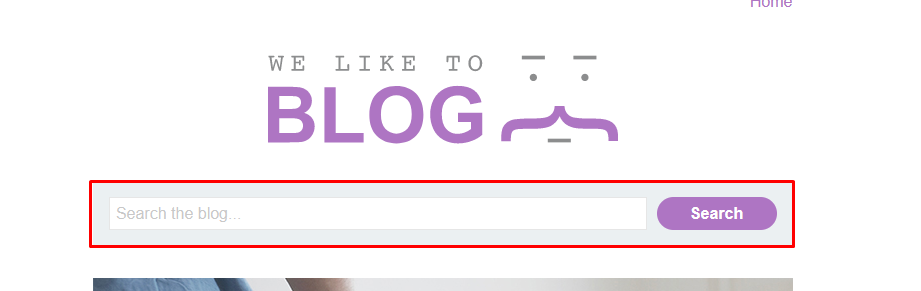
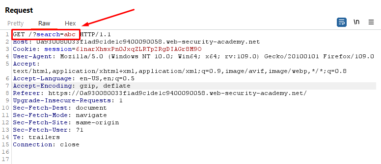
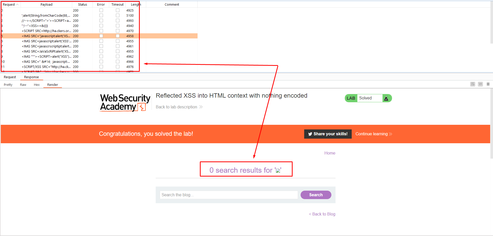
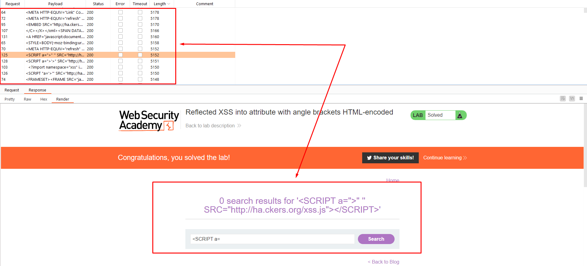
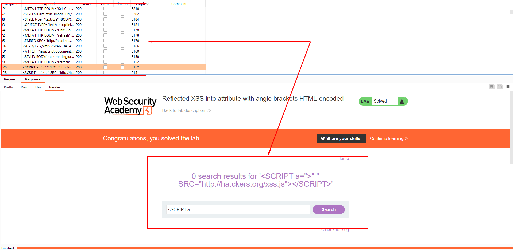

# Portswigger Lab
**XSS in every input field, host headers, url redirections, URI paramenters and file upload namefiles.**
## 1. Reflected XSS into HTML context with nothing encoded
Inject point : Search box

API:

Intruder (BurpSuite payload XSS)

---------------------------------------------------------

## 2. Reflected XSS into attribute with angle brackets HTML-encoded
Inject point : Search box

API:

Intruder (Payload [XSSDetection.txt](https://github.com/swisskyrepo/PayloadsAllTheThings/blob/master/XSS%20Injection/Intruders/XSSDetection.txt))

---------------------------------------------------------

## 3. Reflected XSS into a JavaScript string with angle brackets HTML encoded
Inject point : Search box

API:

Intruder (Payload [XSSDetection.txt](https://github.com/swisskyrepo/PayloadsAllTheThings/blob/master/XSS%20Injection/Intruders/XSSDetection.txt))

