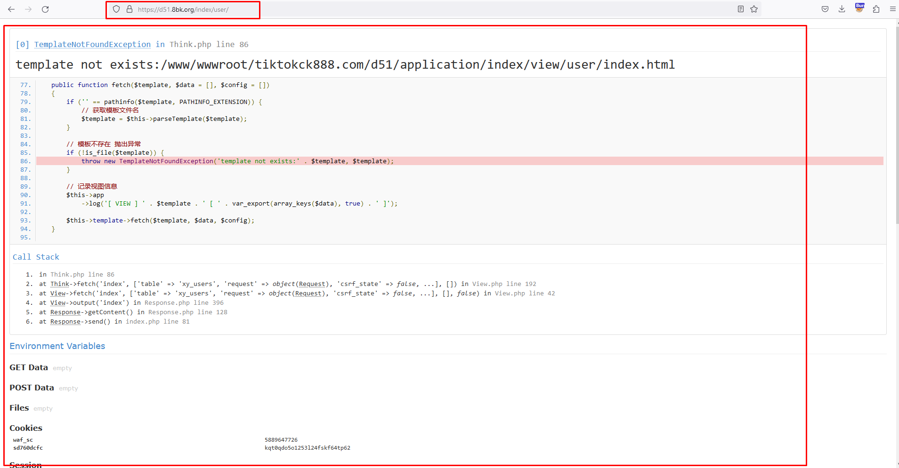
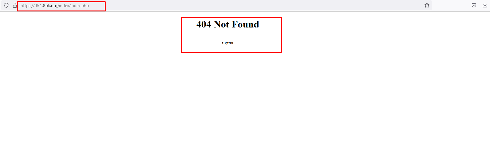
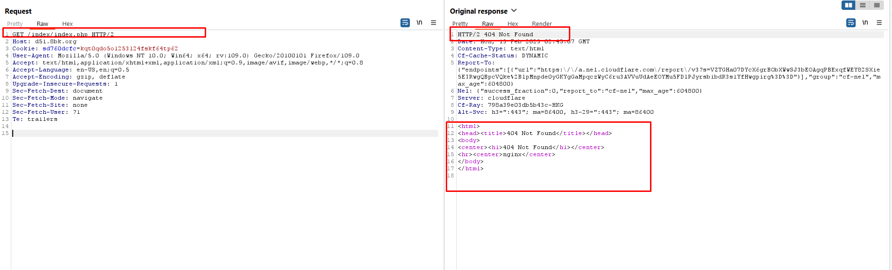

## Web Servers
+ Search for random files and folders that will not be found (404s).
+ Try to request folders that exist and see the server behavior (403s, blank page, or directory listing).
+ Try sending a request that breaks the HTTP RFC. One example would be to send a very large path, break the headers format, or change the HTTP version.

## Applications
+ Identify possible input points where the application is expecting data.
+ Analyse the expected input type (strings, integers, JSON, XML, etc.).
+ Fuzz every input point based
+ Understand the service responding with the error message and try to make a more refined fuzz list to bring out more information or error details from that service (it could be a database, a standalone service, etc.)

-----------------------------
Ex: 

