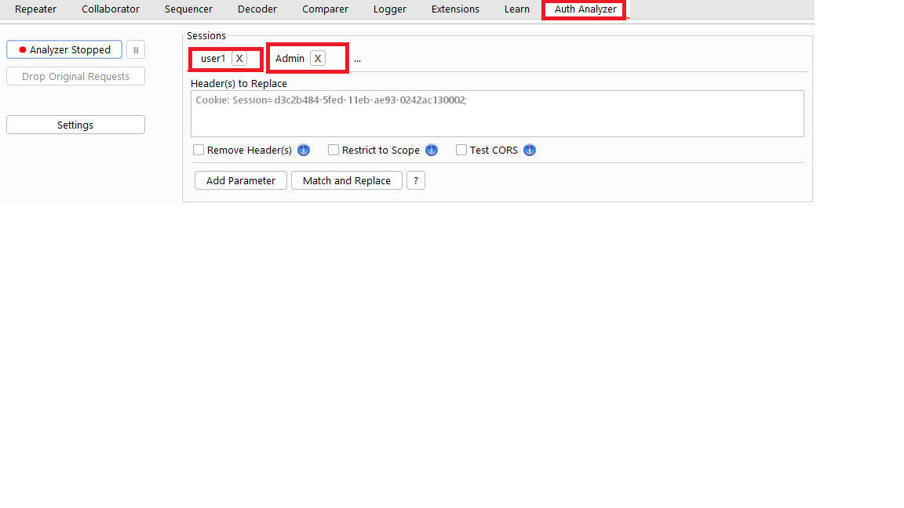

# Identity Management Testing
 
## 1. [Test Role Definitions](https://github.com/OWASP/wstg/blob/master/document/4-Web_Application_Security_Testing/03-Identity_Management_Testing/01-Test_Role_Definitions.md)

## 2. [Test User Registration Process](https://github.com/OWASP/wstg/blob/master/document/4-Web_Application_Security_Testing/03-Identity_Management_Testing/02-Test_User_Registration_Process.md)

## 3. [Test Account Provisioning Process](https://github.com/OWASP/wstg/blob/master/document/4-Web_Application_Security_Testing/03-Identity_Management_Testing/03-Test_Account_Provisioning_Process.md)

## 4. [Testing for Account Enumeration and Guessable User Account](https://github.com/OWASP/wstg/blob/master/document/4-Web_Application_Security_Testing/03-Identity_Management_Testing/04-Testing_for_Account_Enumeration_and_Guessable_User_Account.md)

## 5. [Testing for Weak or Unenforced Username Policy](https://github.com/OWASP/wstg/blob/master/document/4-Web_Application_Security_Testing/03-Identity_Management_Testing/05-Testing_for_Weak_or_Unenforced_Username_Policy.md)

## Need to Check

### IDOR check 

* Cookie variable (e.g. role=admin, isAdmin=True)
* Account variable (e.g. Role: manager)
* Hidden directories or files (e.g. /admin, /mod, /backups)
* Switching to well known users (e.g. admin, backups, etc.)
 
`Use Auth Analyze Extension in BurpSuite`
